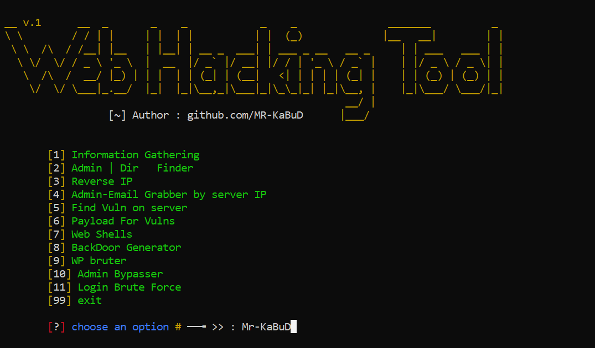

# python-web-hacking v.1

A program for Hackers to Gather information about their targets .

## screen shot :

## Use :
install python 
run this project as  ~ python main.py  
and enjoy :)

## Tools :
* Information Gathering
  * whois
  * port scan
  * whats run
  * get host ip
  * sub domain finder
  * dns lookup
  
* Admin | Dir   Finder
* Reverse IP
* Admin-Email Grabber by server IP
* Payload For Vulnerabilities
  * XSS
  * SQLi
  * OPEN Redirect
  * RFI / LFI
  * RCE
  * CSRF
  
* Web Shells
* BackDoor Generator
* WP bruter (soon)
* Admin Bypasser (soon)
* Login Brute Force (soon)
* Find Vuln on server (soon)

#### I made this tool for myself and put it here for other friends to use.
I hope you like it

! ~   Wait for the next updates :)

### Thanks .
